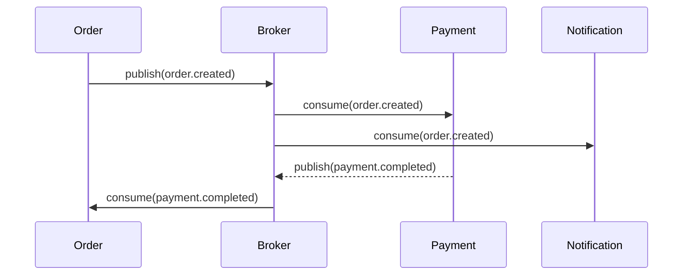

# ADR-0002: Event-Driven vs Synchronous Integration

**Статус:** `accepted`  
**Дата:** 2026-06-26  
**Автор:** Михаил Прасолов

---

## Контекст

В интернет-магазине есть несколько сервисов, которые должны обмениваться данными:

| Сервис | Функция |
|--------|---------|
| Order Service | Оформление заказов |
| Payment Service | Обработка платежей |
| Inventory Service | Управление складом |
| Notification Service | Уведомления клиентов |
| Delivery Service | Доставка |

Сценарий: клиент оформляет заказ → нужно проверить склад, списать товар, обработать платёж, отправить уведомление, запустить доставку.

Как организовать взаимодействие между сервисами?

---

## Драйверы решения

- **Требование:** Слабая связанность сервисов
- **Требование:** Асинхронность — заказ не должен ждать уведомления
- **Требование:** Отказоустойчивость — падение одного сервиса не блокирует другие
- **Ограничение:** Команда имеет опыт работы с RabbitMQ
- **Допущение:** Kafka может быть избыточна для текущих нагрузок

---

## Рассмотренные варианты

### Вариант 1: Event-Driven через Message Broker (выбран)

Схема: Сервисы общаются через брокер сообщений. Order Service публикует событие `order.created`, подписчики реагируют асинхронно.



**Pros:**
- ✅ Полная асинхронность — сервисы не блокируют друг друга
- ✅ Каждый сервис независимо масштабируется
- ✅ При падении Payment, заказ сохраняется, обработка повторится
- ✅ Легко добавить новый подписчик (например, Analytics)

**Cons:**
- ❌ Сложнее отладка — нужно tracing, логи
- ❌ Гарантия доставки — нужен dead letter queue, retry
- ❌ Eventual consistency — данные не сразу согласованы

### Вариант 2: Synchronous REST/RPC

Схема: Order Service последовательно вызывает другие сервисы через REST.

```
Order → Payment → Inventory → Notification → Delivery
```

**Pros:**
- ✅ Простота — каждый разработчик понимает
- ✅ Immediate consistency — ответ пришёл = данные согласованы
- ✅ Простая отладка — curl/log

**Cons:**
- ❌ Последовательность → общее время = сумма всех вызовов
- ❌ Каскадные сбои — падение одного сервиса блокирует цепочку
- ❌ Труднее масштабировать — каждый вызов синхронный

### Вариант 3: Saga (Choreography)

Комбинация: событийно-ориентированная Saga, где каждый сервис публикует событие и подписывается на другие.

**Pros:**
- ✅ Нет центрального оркестратора
- ✅ Компенсирующие транзакции при сбоях

**Cons:**
- ❌ Сложно отлаживать — события размазаны по сервисам
- ❌ Нет единой точки контроля, где посмотреть статус заказа
- ❌ Циклические события сложно предотвратить

---

## Решение

**Выбрано:** Event-Driven через RabbitMQ.

Обоснование:
- Асинхронность критична — заказ не должен ждать уведомление или доставку
- Отказоустойчивость — при падении Notification, заказ всё равно создаётся
- RabbitMQ достаточно для текущих нагрузок (Kafka избыточна)
- Outbox pattern для гарантированной доставки событий

**Дополнительно:** Для операций, где нужна immediate consistency (проверка лимитов, авторизация), используем синхронные REST-вызовы. Гибридный подход.

---

## Последствия

### Позитивные
- ✅ Слабая связанность — сервисы можно менять независимо
- ✅ Масштабирование — каждый сервис масштабируется отдельно
- ✅ Отказоустойчивость — сбой одного не ломает весь процесс
- ✅ Outbox pattern гарантирует доставку событий

### Негативные
- ❌ Eventual consistency — нужно проектировать UI с учётом задержек
- ❌ Сложнее мониторинг — без distributed tracing не обойтись
- ❌ Dead letter queue и retry-механизмы нужно проектировать с самого начала

### Нейтральные
- ➡️ При росте нагрузки можно мигрировать с RabbitMQ на Kafka

---

## Связанные ADR

- [ADR-0001](ADR-0001-rest-vs-graphql.md) — стиль API, REST используется для синхронных вызовов

---

## Ссылки

- [Microsoft — Event-driven architecture style](https://docs.microsoft.com/en-us/azure/architecture/guide/architecture-styles/event-driven)
- [Martin Fowler — What do you mean by "Event-Driven"?](https://martinfowler.com/articles/201701-event-driven.html)
- [Outbox Pattern](https://microservices.io/patterns/data/transactional-outbox.html)
- [Saga Pattern](https://microservices.io/patterns/data/saga.html)

---

*Последнее обновление: 2026-06-26*
