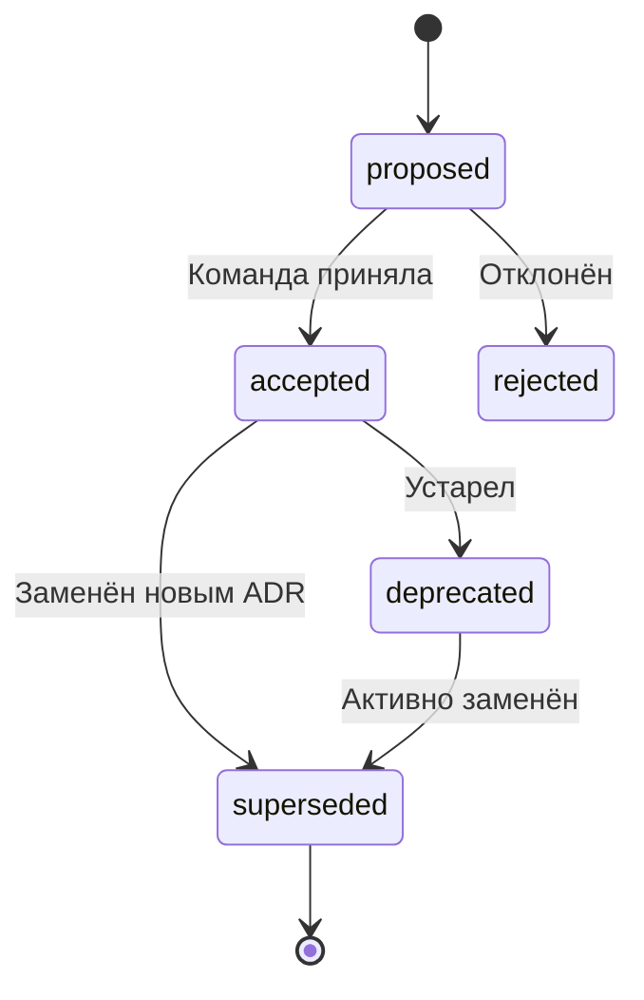

# 📋 Architecture Decision Records (ADR)

> **Статус:** `growing` • **Уровень:** `средний` • **Для:** архитекторов, tech-lead, аналитиков

Полное руководство по ведению ADR: зачем, когда, как писать, шаблоны и примеры.

---

## 🆕 Что нового

| Дата | Изменение |
|------|-----------|
| 2026-06 | Первый релиз: шаблон + 3 учебных примера |

---

## 📋 Содержание

1. [Что такое ADR](#-что-такое-adr)
2. [Зачем вести ADR](#-зачем-вести-adr)
3. [Когда писать ADR](#-когда-писать-adr)
4. [Структура ADR](#-структура-adr)
5. [Статусная модель](#-статусная-модель)
6. [Где хранить](#-где-хранить)
7. [Шаблон](#-шаблон)
8. [Примеры](#-примеры)

---

## 🎯 Что такое ADR

**Architecture Decision Record (ADR)** — короткий документ, который фиксирует одно архитектурное решение: контекст, варианты, обоснование выбора и последствия.

Формат предложил **Michael Nygard** в 2011 году. Сейчас это стандарт индустрии (Martin Fowler, AWS, ThoughtWorks).

### Что ADR НЕ является:
- ❌ Технической документацией API или схемы БД
- ❌ Задачей в Jira
- ❌ Meeting notes
- ❌ Подробным design document (на это есть отдельные документы)

### Что ADR должен быть:
- ✅ **Коротким** — 1-2 страницы, максимум
- ✅ **Сфокусированным** — одно решение = один ADR
- ✅ **Неизменяемым** — принятый ADR не редактируется, но может быть superseded
- ✅ **Понятным** — читается через год как новость (inverted pyramid)

---

## 💡 Зачем вести ADR

| Зачем | Эффект |
|-------|--------|
| **Память команды** | Через год никто не вспомнит "почему мы выбрали Kafka, а не RabbitMQ" |
| **Onboarding** | Новый разработчик читает 5 ADR и понимает архитектуру |
| **Code Review** | PR-ы ссылаются на ADR: "согласно ADR-0003" |
| **Аудит** | Почему принято то или иное решение — для security/compliance |
| **Предотвращение повторных споров** | "/wontfix — обсуждали в ADR-0001, ссылка" |
| **AI-агенты** | Агент читает ADR и понимает контекст проекта, не спрашивая человека |

---

## ⏰ Когда писать ADR

Пиши ADR когда решение:
1. **Архитектурное** — выбор БД, протокола, паттерна
2. **Неочевидное** — с trade-offs, где нет "правильного" ответа
3. **Дорогое в изменении** — если переделывать долго и больно
4. **Спорное** — было несколько мнений в команде
5. **Влияет на другие команды** — интеграция, API-контракты

**Когда НЕ писать:**
- Выбор цвета кнопки
- Название переменной в коде
- Каждый мелкий PR

---

## 🏗 Структура ADR

### Формат Nygard (базовый, для быстрых решений)

```
# ADR-NNNN: Название решения

**Статус:** accepted | proposed | deprecated | superseded
**Дата:** YYYY-MM-DD

## Контекст
Почему это решение нужно? Какие ограничения?

## Решение
Что выбрали? Одним-двумя предложениями.

## Последствия
Плюсы, минусы, нейтральные эффекты.
```

### Формат MADR (расширенный, для сложных решений)

Добавляет секции «Драйверы решения» и «Рассмотренные альтернативы» — полезно когда решение неочевидное и было 3+ варианта.

**Рекомендация:** начинай с Nygard, переходи на MADR когда нужно больше структуры.

Подробнее: [adr.github.io/madr](https://adr.github.io/madr/)

---

## 📊 Статусная модель



| Статус | Значение | Действие |
|--------|----------|----------|
| `proposed` | Предложен, обсуждается | Ждёт ревью команды |
| `accepted` | Принят, решение актуально | Исполняется |
| `rejected` | Отклонён | Причина указана в ADR |
| `deprecated` | Устарел, но не заменён | Использовать не рекомендуется |
| `superseded` | Заменён новым ADR-NNNN | Ссылка на новый ADR |

---

## 📁 Где хранить

```
SA_docs/
├── ADR/
│   ├── README.md            ← этот файл
│   ├── TEMPLATE.md          ← шаблон для копирования
│   ├── ADR-0001-rest-vs-graphql.md
│   ├── ADR-0002-event-driven-vs-sync.md
│   └── ADR-0003-bpmn-vs-c4.md
```

**Правила именования:**
- `ADR-NNNN-kebab-case-title.md`
- Нумерация сквозная, монотонно возрастающая
- Никогда не переиспользовать номер

---

## 📝 Шаблон

Копируй [`TEMPLATE.md`](./TEMPLATE.md) в новый файл и заполняй.

---

## 📚 Примеры

| # | Название | Статус | О чём |
|---|----------|--------|-------|
| 0001 | REST vs GraphQL | `accepted` | Выбор стиля API для микросервисов |
| 0002 | Event-Driven vs Sync | `proposed` | Паттерн интеграции сервисов |
| 0003 | BPMN vs C4 | `accepted` | Инструмент моделирования |

---

## 🔗 Ресурсы

1. [ADR GitHub Organization](https://adr.github.io/)
2. [Michael Nygard — Documenting Architecture Decisions](https://cognitect.com/blog/2011/11/15/documenting-architecture-decisions)
3. [Martin Fowler — Architecture Decision Record](https://martinfowler.com/bliki/ArchitectureDecisionRecord.html)
4. [MADR — Markdown ADR](https://adr.github.io/madr/)
5. [AWS — Best practices for ADRs](https://aws.amazon.com/blogs/architecture/master-architecture-decision-records-adrs-best-practices-for-effective-decision-making/)
6. [Joel Parker Henderson — ADR Examples](https://github.com/joelparkerhenderson/architecture-decision-records)

---

## 🔗 Связанные разделы

- [Structurizr — C4-диаграммы](../Structurizr/README.md) — визуализация архитектуры
- [Sequence Plant UML — диаграммы последовательности](../Sequence%20Plant%20UML/README.md) — детализация сценариев
- [API — проектирование REST API](../API/README.md) — API-стиль, зафиксированный в ADR

---

## 📬 Контакты

- **Автор:** Михаил Прасолов
- **Telegram:** [@MikhailPrasolov](https://t.me/MikhailPrasolov)
- **Канал:** [t.me/systemananalytics](https://t.me/systemananalytics)

---

*Последнее обновление: Июнь 2026*
