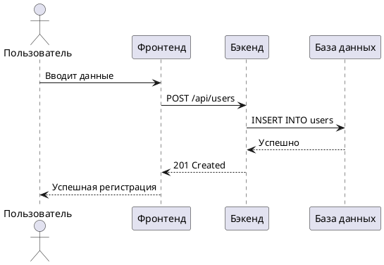
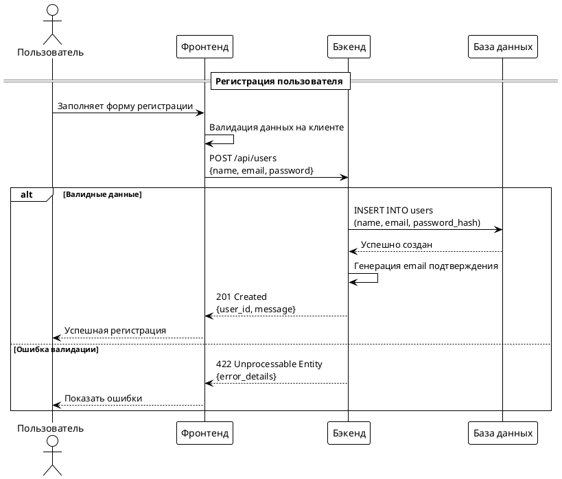
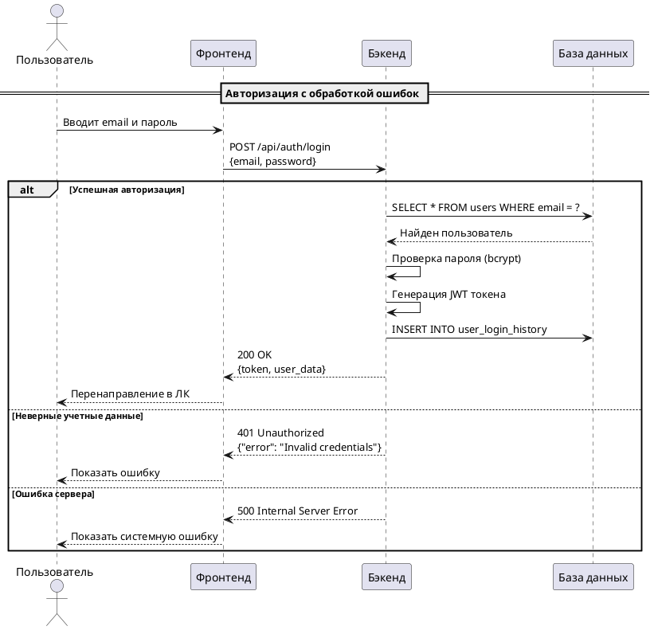

# 📊 Диаграммы последовательности - PlantUML

> Полное руководство по созданию диаграмм последовательности для визуализации бизнес-процессов и взаимодействий между компонентами системы

## 📋 Содержание

1. [Назначение диаграмм](#-назначение-диаграмм)
2. [Синтаксис PlantUML](#-синтаксис-plantuml)
3. [Примеры сценариев](#-примеры-сценариев)
4. [Лучшие практики](#-лучшие-практики)
5. [Инструменты](#-инструменты)
6. [Примеры кода](#-примеры-кода)

---

## 🎯 Назначение диаграмм

Диаграммы последовательности используются для визуализации:
- **Взаимодействия между компонентами** системы
- **Бизнес-процессов** и рабочих потоков
- **Временных зависимостей** между операциями
- **Обработки ошибок** и исключительных ситуаций

### Ключевые преимущества:
- **Наглядность** — легко понять последовательность действий
- **Универсальность** — подходит для технических и бизнес-аудиторий
- **Документирование** — служит технической документацией
- **Обнаружение проблем** — помогает выявить узкие места

---

## 📝 Синтаксис PlantUML

### Базовые элементы



### Основные конструкции

| Конструкция | Назначение |
|-------------|------------|
| `actor` | Внешний пользователь системы |
| `participant` | Участник процесса |
| `->` | Сообщение/вызов |
| `-->` | Ответ/возврат |
| `alt` | Альтернативные сценарии |
| `loop` | Циклы |
| `opt` | Опциональные действия |

---

## 🎭 Примеры сценариев

### 1. Регистрация пользователя

**Участники:**
- **Пользователь** — инициирует процесс
- **Фронтенд** — интерфейс пользователя
- **Бэкенд** — бизнес-логика
- **База данных** — хранение данных

**Процесс:**
1. Пользователь вводит данные регистрации
2. Фронтенд валидирует данные на клиенте
3. Отправляется запрос на бэкенд
4. Бэкенд проверяет уникальность email
5. Создается запись в базе данных
6. Отправляется email подтверждения
7. Возвращается успешный ответ

### 2. Авторизация пользователя

**Процесс:**
1. Пользователь вводит учетные данные
2. Бэкенд проверяет хэш пароля
3. Генерируется JWT токен
4. Записывается история входа
5. Возвращается токен авторизации

### 3. Обработка ошибок

**Сценарии:**
- Неверные учетные данные
- Истекший токен
- Ошибка валидации данных
- Проблемы с базой данных

---

## 🏗 Лучшие практики

### 1. Структура диаграммы
- **Начинайте с актора** — кто инициирует процесс
- **Используйте понятные имена** участников
- **Группируйте связанные действия** — alt/loop/opt
- **Добавляйте комментарии** для сложных операций

### 2. Именование
- **Участники** — роли или названия компонентов
- **Сообщения** — действия или API endpoints
- **Альтернативы** — условия или бизнес-правила

### 3. Визуализация
- **Используйте цвета** для выделения важных частей
- **Разделяйте сценарии** успеха и ошибок
- **Добавляйте временные метки** для критичных операций

---

## 🛠 Инструменты

| Инструмент | Назначение |
|------------|------------|
| [PlantUML Online](https://www.plantuml.com/plantuml) | Онлайн редактор |
| [PlantText](https://www.planttext.com/) | Альтернативный онлайн редактор |
| [VS Code Extension](https://marketplace.visualstudio.com/items?itemName=jebbs.plantuml) | Интеграция с VS Code |
| [IntelliJ IDEA Plugin](https://plugins.jetbrains.com/plugin/7017-plantuml-integration) | Интеграция с IntelliJ |

---

## 💻 Примеры кода

### Базовый шаблон


### Сценарий с ошибками


---

## 🤖 Использование Context7

Context7 предоставляет актуальную документацию для работы с PlantUML:

```
Создай диаграмму последовательности для процесса оплаты заказа. use context7
```

```
Настрой интеграцию PlantUML в VS Code. use context7
```

```
Создай шаблон диаграммы для микросервисной архитектуры. use context7
```

### Популярные ID библиотек:
- `/plantuml/plantuml` - PlantUML
- `/uml/uml` - UML диаграммы
- `/software-architecture/software-architecture` - Архитектура ПО

---

## 📚 Ресурсы

1. [PlantUML Language Guide](https://plantuml.com/guide)
2. [PlantUML Sequence Diagram](https://plantuml.com/sequence-diagram)
3. [UML Sequence Diagrams](https://www.uml-diagrams.org/sequence-diagrams.html)
4. [Software Architecture Documentation](https://c4model.com/)

---

## 📁 Файлы в разделе

- [`Шаблон Sequence .wsd`](./Шаблон%20Sequence%20.wsd) — базовый шаблон для новых диаграмм
- [`Пример Sequence.wsd`](./Пример%20Sequence.wsd) — реальный пример диаграммы

---

## 📬 Контакты

- 🔗 **Контакты автора**  
  • TG: [@MikhailPrasolov](https://t.me/MikhailPrasolov)  
  • Канал: [t.me/systemananalytics](https://t.me/systemananalytics)

> Если заметили ошибку или хотите дополнить материалы — смело открывайте Issue или присылайте Pull Request!

---

*Последнее обновление: Ноябрь 2024*
