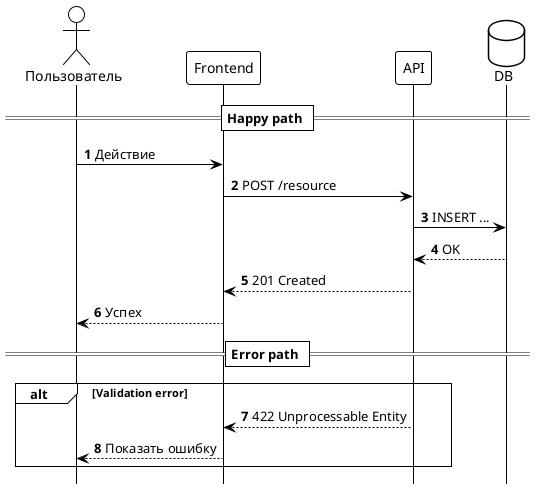

# 📊 Sequence Diagram (PlantUML) — актуализированный гайд

> Раздел обновлён под практики 2025: единый стиль, явная обработка ошибок, идемпотентность, async-сценарии и подготовка к ревью архитектуры.

## 📋 Что в папке

- `Шаблон Sequence .wsd` — базовый шаблон для новых диаграмм.
- `Пример Sequence.wsd` — детальный сценарий User Management.
- `Пример Sequence - Оплата заказа.wsd` — современный платёжный поток (3DS + webhook + идемпотентность).
- `Пример Sequence - Асинхронная интеграция.wsd` — пример событийной интеграции через Kafka/outbox.

---

## 🔎 Результаты анализа и что было улучшено

В старой версии материалов были сильные стороны (легенда, цветовые заметки, бизнес-фокус), но также встречались устаревшие/нестабильные паттерны:

1. Непоследовательное именование участников и алиасов.
2. Перегруженные блоки без явного разделения на happy-path и error-path.
3. Недостаточная фиксация интеграционных требований (идемпотентность, webhook, retry, DLQ).
4. Смешение уровня абстракции (API, код и инфраструктура в одном блоке без структуры).

В обновлённой версии это нормализовано через единый шаблон и 3 рабочих примера.

---

## ✅ Регламенты для новых Sequence-диаграмм

Используйте эти правила как Definition of Done для диаграммы:

### 1) Структура
- Один `@startuml` = один бизнес-сценарий.
- Секции через `== ... ==`: инициация, обработка, альтернативы, завершение.
- Обязателен минимум один `alt/else` для ошибок.

### 2) Именование
- Участники: роль или системный компонент (`Order API`, `Payment Service`, `Kafka Topic`).
- Сообщения: глагол + полезная нагрузка/endpoint (`POST /orders`, `publish(OrderCreated)`).
- Не использовать расплывчатые подписи вроде «что-то сделал».

### 3) Интеграционные требования
- Для внешних API: показывать idempotency key.
- Для callbacks/webhooks: отдельный шаг в диаграмме + валидация подписи.
- Для async-обмена: отражать retry/backoff/DLQ как минимум в notes или alt-ветках.

### 4) Визуальная читаемость
- `!theme plain`, `hide footbox`, `autonumber`.
- До ~25 сообщений на диаграмму; если больше — разбивать на 2+ диаграмм.
- Цвета использовать только для смыслового акцента (ошибки/создание/удаление).

### 5) Проверка перед merge
- Диаграмма рендерится без ошибок синтаксиса.
- Ветви happy-path/error-path завершены и понятны бизнесу.
- Названия endpoint/событий согласованы с API/Event-контрактами.

---

## 🤖 Использование Context7 в задачах по PlantUML

Ниже готовые промпты для актуализации диаграмм с опорой на документацию:

```text
Сгенерируй sequence-диаграмму для регистрации пользователя в микросервисной архитектуре.
Требования: happy-path + 2 error-path, webhook/email confirmation, idempotency key.
Используй PlantUML best practices 2025. use context7
```

```text
Проверь диаграмму оплаты заказа на архитектурные риски и предложи улучшения
(таймауты, retries, DLQ, outbox, consistency boundaries). use context7
```

```text
Сделай рефакторинг текущей sequence-диаграммы: унифицируй нейминг участников,
добавь разделы через == ... ==, исправь сообщения на endpoint/event-стиль. use context7
```

Рекомендуемые библиотеки/источники в Context7:
- `/plantuml/plantuml`
- `/uml/uml`
- `/software-architecture/software-architecture`

---

## 🧩 Быстрый старт: шаблон


```plantuml
@startuml Example
!theme plain
hide footbox
autonumber

actor "Пользователь" as U
participant "Frontend" as FE
participant "API" as API
database "DB" as DB

== Happy path ==
U -> FE : Действие
FE -> API : POST /resource
API -> DB : INSERT ...
DB --> API : OK
API --> FE : 201 Created
FE --> U : Успех

== Error path ==
alt Validation error
  API --> FE : 422 Unprocessable Entity
  FE --> U : Показать ошибку
end
@enduml
```

---

## 📚 Ресурсы

1. https://plantuml.com/sequence-diagram
2. https://plantuml.com/guide
3. https://www.uml-diagrams.org/sequence-diagrams.html

---

## 📬 Контакты

- Автор: Михаил Прасолов
- Telegram: [@MikhailPrasolov](https://t.me/MikhailPrasolov)
- Канал: [t.me/systemananalytics](https://t.me/systemananalytics)

*Последнее обновление: Март 2026*
